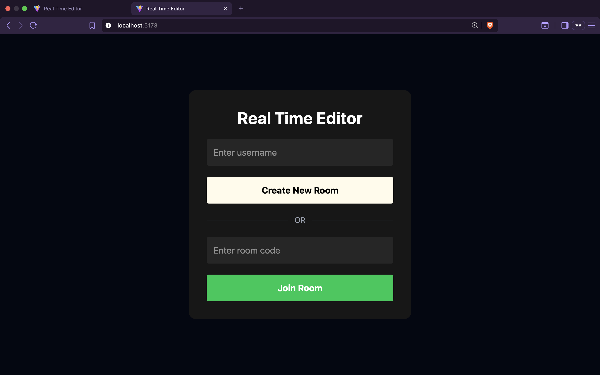
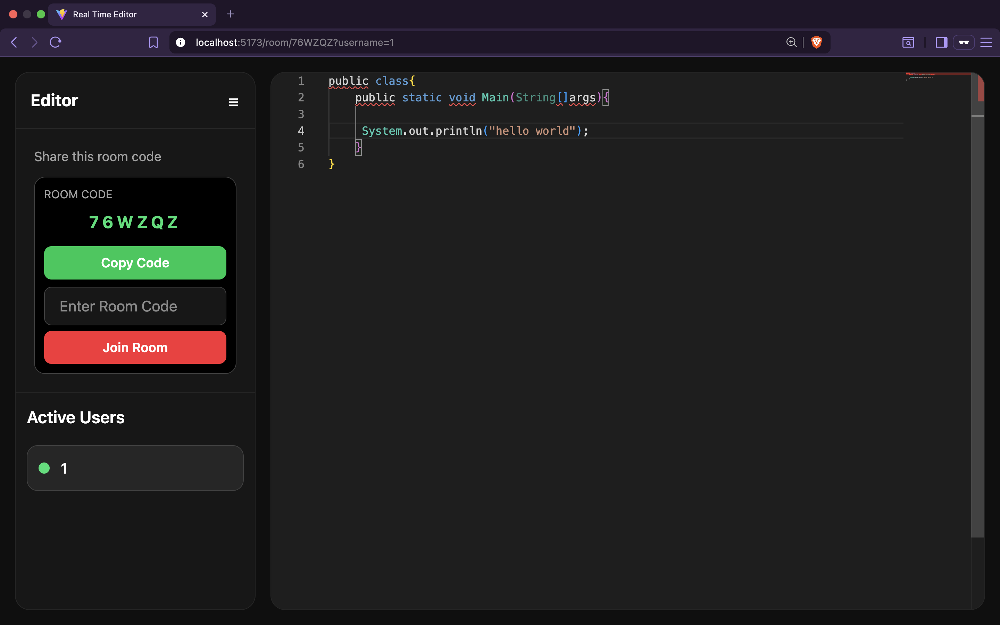
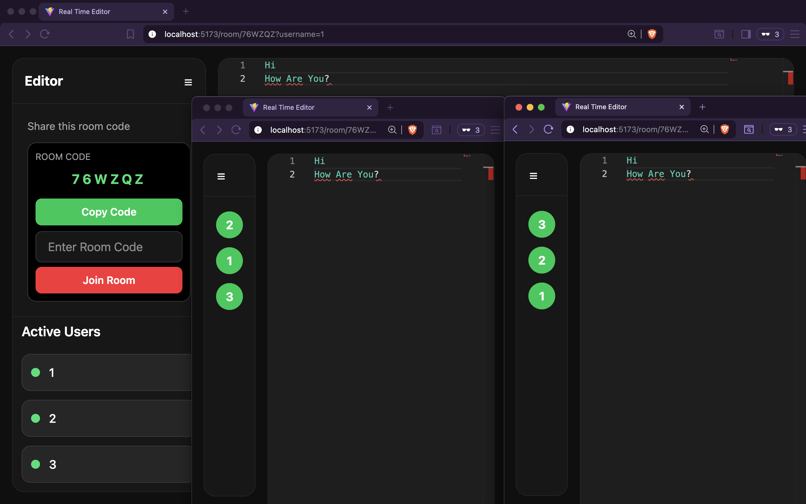

# Real-Time Collaborative Editor

A real-time collaborative editor built using React, Monaco Editor, Yjs, Socket.io, and Node.js.

Users can create or join rooms using unique room codes and collaborate together in real time.

---
## Screenshots

### Home Page



---

### Collaborative Editor



---

### Collapsed Sidebar View



---

## Features

- Real-time collaboration
- Room based editing
- Unique room codes
- Active users panel
- Monaco editor integration
- Yjs synchronization
- Modern UI with Tailwind CSS

---

## Tech Stack

### Frontend
- React.js
- React Router DOM
- Tailwind CSS
- Monaco Editor
- Yjs
- nanoid

### Backend
- Node.js
- Express.js
- Socket.io
- y-socket.io

---

## Project Structure

```txt
Real-Time-Editor/
│
├── backend/
│   ├── README.md
│   └── server.js
│
├── frontend/
│   ├── README.md
│   └── src/
│       ├── App.jsx
│       ├── main.jsx
│       └── pages/
│
└── README.md
```

---

## Local Setup

### Backend

```bash
cd backend
npm install
npm run dev
```

### Frontend

```bash
cd frontend
npm install
npm run dev
```

---

## Notes

Detailed implementation notes are available inside:

- `frontend/README.md`
- `backend/README.md`

---

## Future Improvements

- Persistence
- Authentication
- Docker deployment
- Cursor presence
- Private rooms

---

## Author

Anubhav Kulshreshtha
